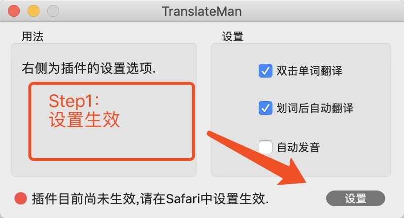
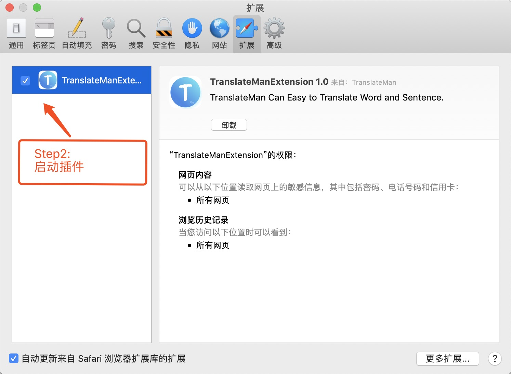
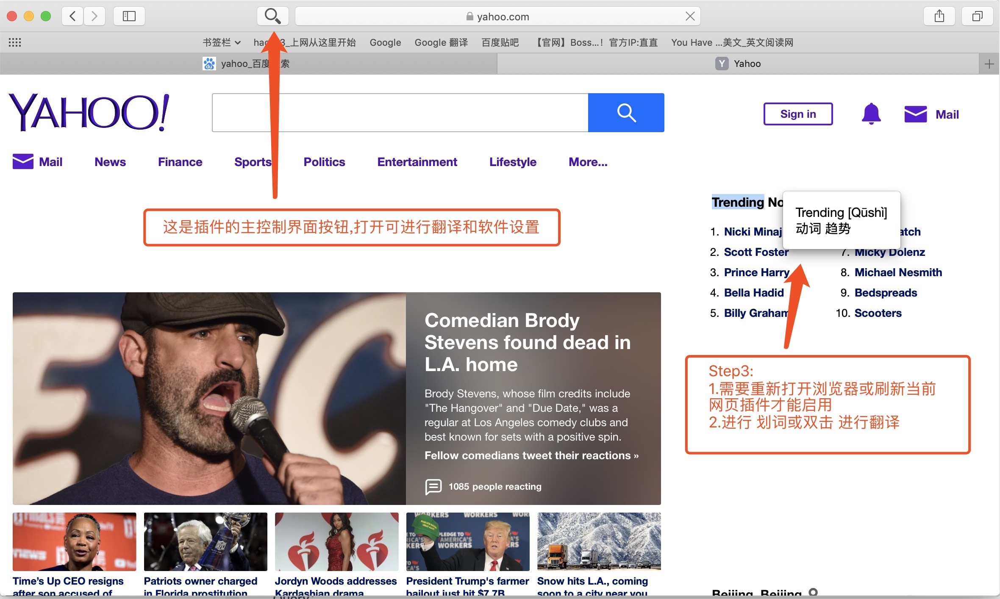

# 翻译官 for Safari(TranslateMan) 使用说明

## 操作指南

### 1.设置启用插件
      (1)在软件中点击设置.
      (2)在Safari插件设置中将TranslateMan设置为开启
      (3)返回软件看插件状态是否已经改为启动并可进行软件设置

### 2.启动Safari并使用
      (1)插件启用后需要用户重新启动Safari浏览器或从新刷新当前页面(刷新才能将插件翻译代码注入页面中)
      (2)进行划词操作和双击操作选择文字,稍有延迟后弹出 翻译弹窗
      (3)软件主体界面可以更精确的翻译和多种语言翻译，也可以设置插件启动状态

### 3.图文操作 
 -------------  
 图示:  

## 问题答疑

### 1.网页上划词或双击不显示翻译窗怎么办?
      (1)软件第一版只支持网页上的英文->中文,其他语言设置请稍等后续版本加入
      (2)插件启用后，必须要 重新启动Safari浏览器或刷新当前网页才可以生效(刷新才能将插件翻译代码注入页面中)
      (3)有些语句不显示翻译弹窗，可能是Google服务翻译出错，正在排查..

### 2.翻译后的内容还不够丰富没有Google翻译出的结果详细怎么办?
      目前进行显示UI和翻译结果升级，更多的翻译内容如(近义词,例句等等)会在后续版本中加入

### 3.找不到支持的语种怎么办?

      点击软件设置->语言 即可设置，没有的请联系我进行添加
   
### 4.看过上面的指南还有软件使用问题怎么办?
      可第一时间联系swain6@163.com进行解决，软件会更加完善

